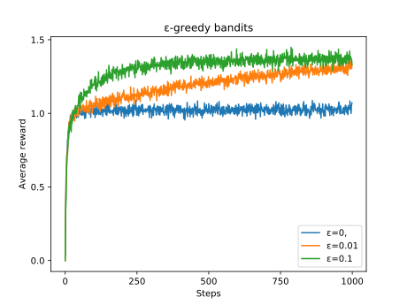
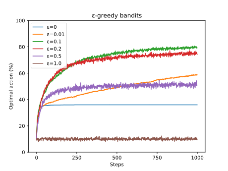
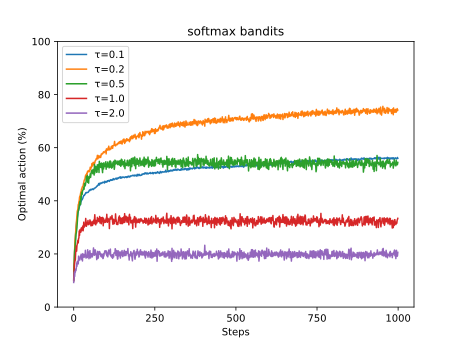
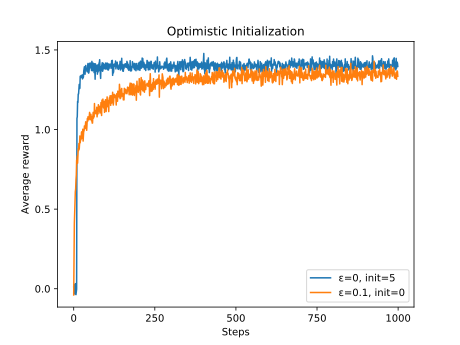
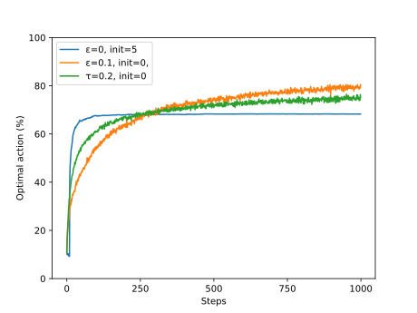

# Bandits

## Results

### Stationary Environment

#### Comparison from the book

 

```
python -m scripts.compare_bandits_stationary images/book_1 -a epsilon epsilon epsilon -s 0.0 0.01 0.1 -l "ε=0", "ε=0.01" "ε=0.1" -t "ε-greedy bandits"
```

#### Epsilon-greedy bandits




```
python -m scripts.compare_bandits_stationary images/epsilon -a epsilon epsilon epsilon epsilon epsilon epsilon -s 0.0 0.01 0.1 0.2 0.5 1.0 -l "ε=0" "ε=0.01" "ε=0.1" "ε=0.2" "ε=0.5" "ε=1.0" -t "ε-greedy bandits"
```

#### Softmax bandits




```
python -m scripts.compare_bandits_stationary images/softmax -a softmax softmax softmax softmax softmax -s 0.1 0.2 0.5 1.0 2.0 -l "τ=0.1" "τ=0.2" "τ=0.5" "τ=1.0" "τ=2.0" -t "softmax bandits"
```

#### Optimistic initialization




```
python -m scripts.compare_bandits_stationary images/optimistic_init -a epsilon epsilon -s 0.0 0.1 -i 5.0 0.0 -l "ε=0, init=5" "ε=0.1, init=0" -t "Optimistic Initialization"
```

#### Final Comparison




```
python -m scripts.compare_bandits_stationary images/epsilon_vs_softmax_vs_optimistic -a epsilon epsilon softmax -s 0.1 0.0 0.2 -l "ε=0.1, init=0", "ε=0, init=5" "τ=0.2, init=0" -i 0.0 5.0 0.0
```

### Non-stationary Environment


```
python -m scripts.compare_bandits_nonstationary images/nonstationary -a epsilon epsilon -s 0.1 0.1 --alphas 0.0 0.1 -l "α=1/k" "α=0.1" -t "ε-greedy bandits, ε=0.1"
```

## Setup

Install Python3 and packages listed in requirements.txt.

## Usage

