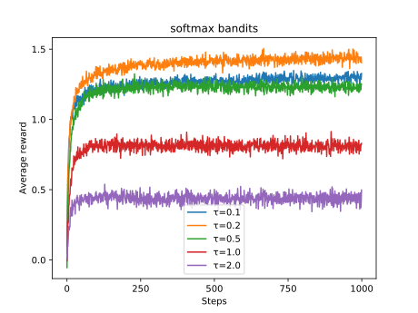
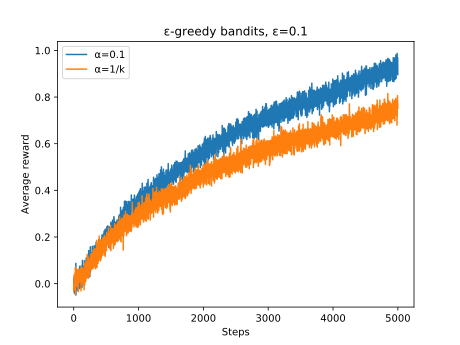
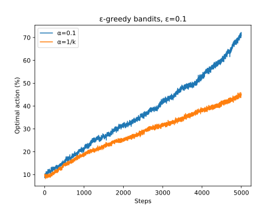

# Bandits

Experiments with a few bandit algorithms from the 2nd chapter of Sutton and Barton's Reinforcement Learning: An Introduction.

## Results

Each plot has a corresponding command that you can call to replicate it yourself.

### Stationary Environment

The values for each action are drawn from a normal distribution with zero mean and unit variance and do not change during the experiment.
The bandits take 1000 steps in the environment choosing from 10 actions during each step. The experiments are repeated 2000 times.

#### Comparison from the book

I replicated Figure 2.1 from the book to check my implementation. ε-greedy bandit outperforms a greedy bandit in this simple testbed.


```
python -m scripts.compare_bandits_stationary images/book_1 -a epsilon epsilon epsilon -s 0.0 0.01 0.1 -l "ε=0", "ε=0.01" "ε=0.1" -t "ε-greedy bandits"
```

#### Epsilon-greedy bandits

Next, I compare ε-greedy bandits with different exploration settings. ε=0.1 performs the best.


```
python -m scripts.compare_bandits_stationary images/epsilon -a epsilon epsilon epsilon epsilon epsilon epsilon -s 0.0 0.01 0.1 0.2 0.5 1.0 -l "ε=0" "ε=0.01" "ε=0.1" "ε=0.2" "ε=0.5" "ε=1.0" -t "ε-greedy bandits"
```

#### Softmax bandits

Another type of bandit presented in the book is softmax bandit. Softmax bandits should perform better than ε-greedy bandits in theory because 
they avoid bad actions even during exploration. 
However, they are quite sensitive to the temperature parameter setting.




```
python -m scripts.compare_bandits_stationary images/softmax -a softmax softmax softmax softmax softmax -s 0.1 0.2 0.5 1.0 2.0 -l "τ=0.1" "τ=0.2" "τ=0.5" "τ=1.0" "τ=2.0" -t "softmax bandits"
```

#### Optimistic initialization

Optimistic Initialization is an alternative to ε-greedy or softmax exploration policies. It outperforms ε-greedy bandit 
in this simple environment but has some drawback, like an inability to track non-stationary rewards.


```
python -m scripts.compare_bandits_stationary images/optimistic_init -a epsilon epsilon -s 0.0 0.1 -i 5.0 0.0 -l "ε=0, init=5" "ε=0.1, init=0" -t "Optimistic Initialization"
```

#### Final Comparison

Finally, I compare the best ε-greedy, softmax and optimistically initalized bandits. Softmax bandits wins by a small margin.


```
python -m scripts.compare_bandits_stationary images/epsilon_vs_softmax_vs_optimistic -a epsilon epsilon softmax -s 0.1 0.0 0.2 -l "ε=0.1, init=0", "ε=0, init=5" "τ=0.2, init=0" -i 0.0 5.0 0.0
```

### Non-stationary Environment

In this non-stationary environment experiments, all action values start at 0. After each step of the agents, 
the action values take a small random step drawn from a normal distribution. Therefore, the action values change as 
the bandits interact with the environment.

I compare the ε-greedy bandit from the previous section with a modified version that uses a constant α during sample 
averaging. Constant α value causes it to prioritize recent rewards, which models the non-stationary environment better.




```
python -m scripts.compare_bandits_nonstationary images/nonstationary -a epsilon epsilon -s 0.1 0.1 --alphas 0.0 0.1 -l "α=1/k" "α=0.1" -t "ε-greedy bandits, ε=0.1"
```

## Setup

Install Python3 and packages listed in requirements.txt.
