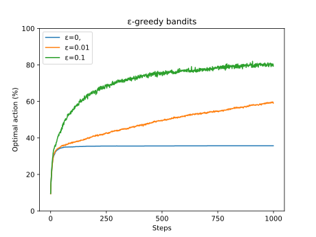
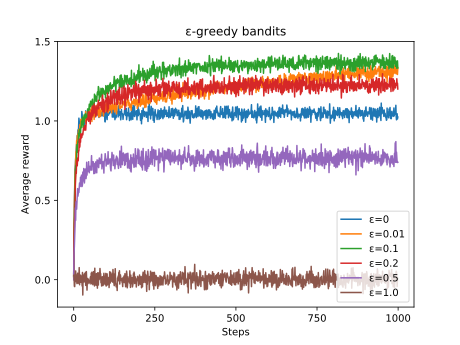
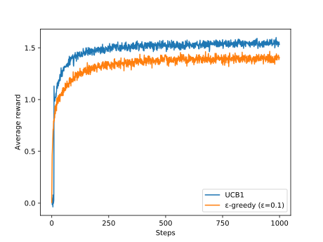
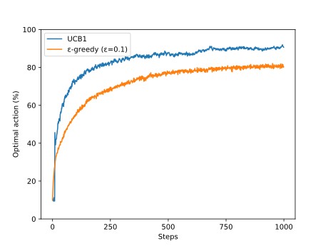
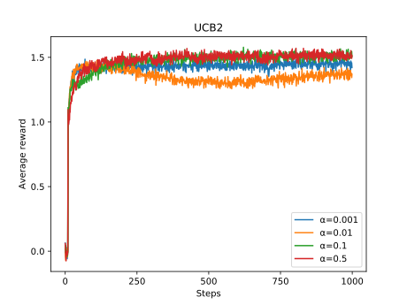
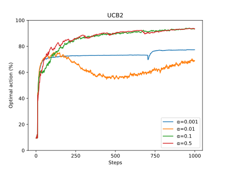
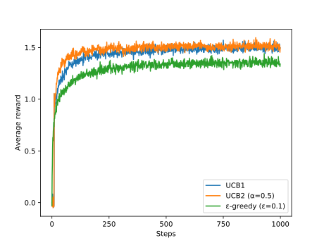
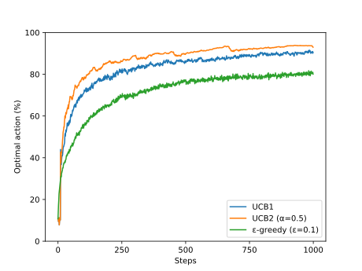

# Bandits

Experiments with bandit algorithms from the 2nd chapter of Sutton and Barto's Reinforcement Learning: An Introduction.

## Results

You can generate each plot with the command written under it.

### Stationary Environment

The experimental setup follows the one described in the book:

The values for each action are drawn from a normal distribution with zero mean and unit variance and do not change 
during the experiment. The bandits take 1000 steps in the environment choosing from 10 actions at each step.
Furthermore, the bandits observe rewards with noise drawn from normal distribution with zero mean and unit variance 
added to the action values. The experiments are repeated 2000 times.

I plot the average reward and the percentage of times the bandit chose the optimal actions.

#### Comparison from the book

I replicated Figure 2.1 from the book to check my implementation. ε-greedy bandit outperforms a greedy bandit in this 
simple testbed.




```
python -m scripts.compare_bandits_stationary images/book_1 -a epsilon epsilon epsilon -s 0.0 0.01 0.1 -l "ε=0", "ε=0.01" "ε=0.1" -t "ε-greedy bandits"
```

#### Epsilon-greedy bandits

Next, I compare ε-greedy bandits with different exploration settings. ε=0.1 performs the best.




```
python -m scripts.compare_bandits_stationary images/epsilon -a epsilon epsilon epsilon epsilon epsilon epsilon -s 0.0 0.01 0.1 0.2 0.5 1.0 -l "ε=0" "ε=0.01" "ε=0.1" "ε=0.2" "ε=0.5" "ε=1.0" -t "ε-greedy bandits"
```

#### Softmax bandits

Another type of bandit presented in the book is the softmax bandit. Softmax bandits should perform better than 
ε-greedy bandits because they avoid bad actions during exploration. However, they are quite sensitive to the 
temperature (τ) parameter setting.


```
python -m scripts.compare_bandits_stationary images/softmax -a softmax softmax softmax softmax softmax -s 0.1 0.2 0.5 1.0 2.0 -l "τ=0.1" "τ=0.2" "τ=0.5" "τ=1.0" "τ=2.0" -t "softmax bandits"
```

#### Optimistic initialization

Optimistic Initialization is an alternative to ε-greedy or softmax exploration policies. It outperforms the ε-greedy 
bandit in this simple environment but has some drawback (e.g. it cannot track non-stationary rewards). Interestingly,
the optimistically initialized bandit chooses the optimal action with lower frequency than the ε-greedy bandit
but still achieves higher average reward.


```
python -m scripts.compare_bandits_stationary images/optimistic_init -a epsilon epsilon -s 0.0 0.1 -i 5.0 0.0 -l "ε=0, init=5" "ε=0.1, init=0" -t "Optimistic Initialization"
```

#### Final Comparison

Finally, I compare the best ε-greedy, softmax and optimistically initialized bandits. The softmax bandit wins by a 
small margin.


```
python -m scripts.compare_bandits_stationary images/epsilon_vs_softmax_vs_optimistic -a epsilon epsilon softmax -s 0.1 0.0 0.2 -l "ε=0.1, init=0", "ε=0, init=5" "τ=0.2, init=0" -i 0.0 5.0 0.0
```

### Non-stationary Environment

In this experiment, all action values start at 0. After all agents perform a single action, the action values take a 
small random step drawn from a normal distribution. Therefore, the action values change as the bandits interact with 
the environment.

I compare the ε-greedy bandit from the previous section with a modified version that uses a constant α during sample 
averaging. Constant α value causes it to prioritize recent rewards, which models the non-stationary environment better.

The agents take 5000 steps in the environment instead of 1000, so that we can see the gap between the two agents 
increase.


```
python -m scripts.compare_bandits_nonstationary images/nonstationary -a epsilon epsilon -s 0.1 0.1 --alphas 0.0 0.1 -l "α=1/k" "α=0.1" -t "ε-greedy bandits, ε=0.1"
```

### Advanced Bandits in a Stationary Environment ###

#### UCB ####

[UCB bandits](https://webdocs.cs.ualberta.ca/~games/go/seminar/notes/2007/slides_ucb.pdf) 
establish an upper bound on regret–how much we loose for not playing the optimal action.
UCB1 beats ε-greedy while not having any parameters to tune.




```
python -m scripts.compare_bandits_stationary images/ucb1 -a ucb1 epsilon -s 0.0 0.1 -l "UCB1" "ε-greedy (ε=0.1)"
```

UCB2 tightens the bound on the regret but introduces an additional parameter α.




```
python -m scripts.compare_bandits_stationary images/ucb2_alpha -a ucb2 ucb2 ucb2 ucb2 -s 0.001 0.01 0.1 0.5 -l "α=0.001" "α=0.01" "α=0.1" "α=0.5" -t UCB2
```

UCB2 reaches optimal performance faster than UCB1..




```
python -m scripts.compare_bandits_stationary images/ucb2 -a ucb2 ucb1 epsilon -s 0.5 0.0 0.1 -l "UCB2 (α=0.5)" "UCB1" "ε-greedy (ε=0.1)"
```

## Setup

Install Python 3 and all packages listed in requirements.txt.

## Usage

Each scripts contains documentation for all arguments.

For stationary experiments, execute:

```
python -m scripts.compare_bandits_stationary -h
```

and for non-stationary experiments:

```
python -m scripts.compare_bandits_nonstationary -h
```